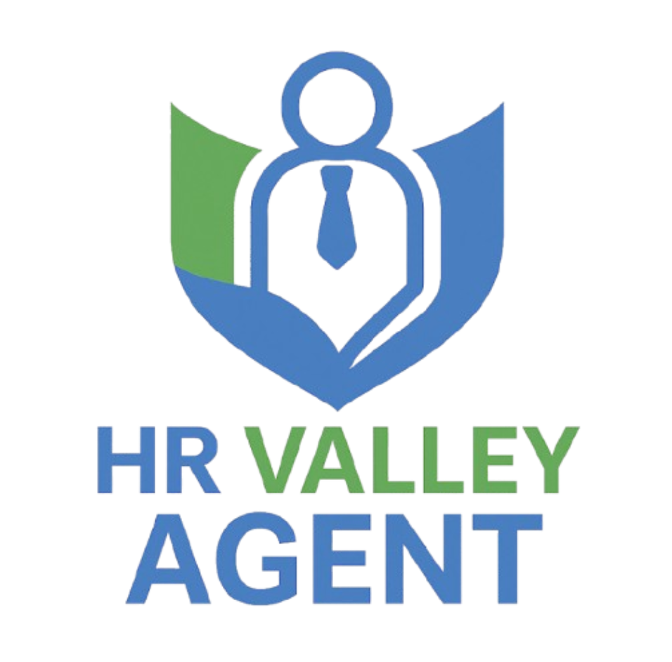
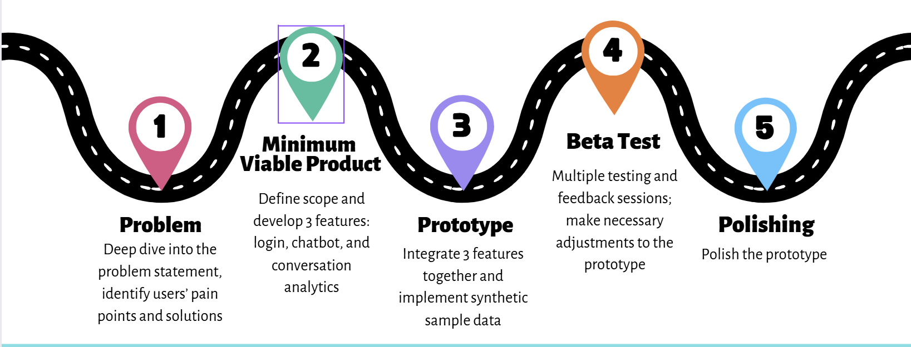

# Flow
Valley Water HR Agent, Powered by OpenAI

  

## Overview

An AI-powered HR Agent that provides Valley Water employees with 24/7 HR support while supporting administrators with real-time analytics to improve workforce management.

## What is Flow?

Like the flow of water, the system ensures seamless HR communication—adapting to employee needs while providing administrators with clear visibility into trends and risks. 

Flow consists of two main components:

1. HR Chatbot
   - Provides 24/7 personalized HR assistance to all employees.
   - Answers questions on benefits, leave policies, training, compliance, and more.
2. HR Portal
   - Tracks chatbot interaction trends, sentiment metrics, and key operational insights.
   - Offers administrators advanced analytics, AI-driven recommendations, and interactive data visualizations.

## Why Flow?
Flow is designed to address the challenges that Valley Water employees and HR teams are facing:
**For Employees**
- Difficulty finding up-to-date policy information
- Long wait times for HR responses
- Little support for benefit utilization
**For HR Team**
- Overwhelming volume of repetitive inquiries
- Lack of visibility into employee sentiment trends
- Manual processes for tracking issues

## Our Solution
We built Flow using:
- Streamlit for the web interface
- OpenAI API for:
  - Natural language processing (3.5 turbo)
  - AI analytics and recommendation (4.0 mini)

**For Employees:**
1. Login Portal
   - Secure access with employee credentials
   - Role-based access permissions
2. Chatbot
   - Instant answers sourced from Valley Water HR documents
   - Smart follow-up questions to explore topics thoroughly
   - Personalized benefit optimization suggestions
   - Emergency detection and ticket creation

**For HR Admins:**
1. Dashboard
   - Real-time conversation metrics
   - Visual topic analysis (donut charts, trend lines)
   - Emergency ticket details
2. Conversation History
   - Complete interaction logs
   - Advanced filtering by department/date/keyword
   - Threaded view and conversation summary for context
3. AI-powered Insights Hub
   - Executive summary of key metrics
   - FAQs from conversation history
   - Deep topic analysis with root cause identification
   - Sentiment analysis and emotion detection
   - Actionable policy improvement recommendations

## Demo Video
[Watch the demo video](https://drive.google.com/file/d/18K8xbLOcnCQiYvv0XLuFrtQ6p8HKkhNk/view?usp=sharing)

## Initial Project Diagram (Early Version)

  

## Our RoadMap

  

